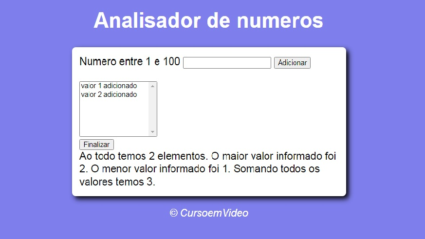

## Analisador de Numeros
Insira números e ele dirá quantos elementos foram adicionados, o maior e o menor elemento e a soma entre eles.

## Sobre
Um exercício para treino de lógica e funcionalidades do JavaScript.

## Desenvolvimento

Projeto feito conforme desenvolvimento do curso de JavaScript do <i>Curso em Video</i>.

## Tecnologias
- HTML
- CSS
- JavaScript